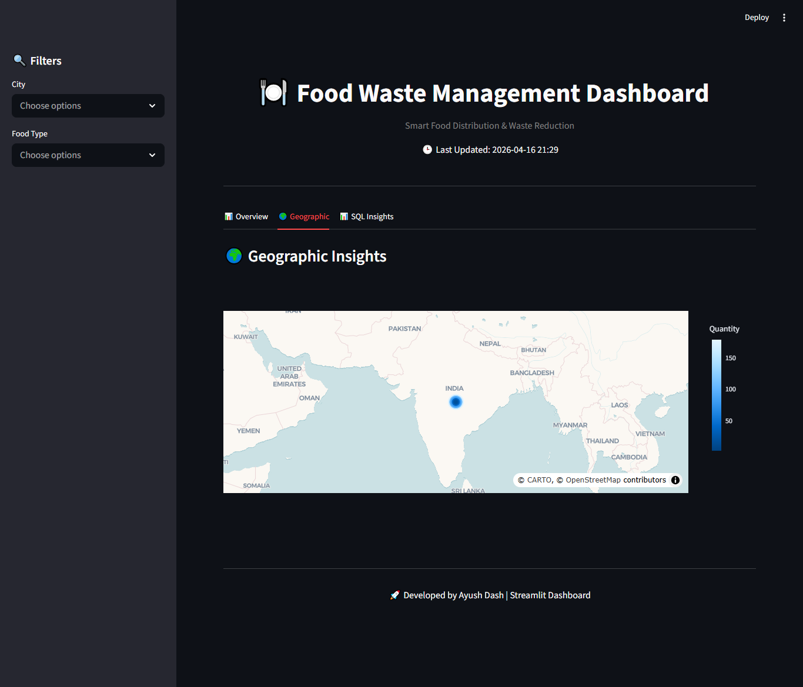

# 🍽️ Food Waste Management Dashboard

🚀 An interactive data analytics dashboard to reduce food waste and optimize food distribution using real-time insights.

---

## 📌 Project Overview

The **Food Waste Management Dashboard** is a data analytics solution built using **Streamlit and MySQL**.  
It helps track food availability, monitor claims, and analyze distribution patterns to minimize food wastage.

This system connects **food providers** (restaurants, grocery stores) with **receivers** (NGOs, individuals) to ensure efficient redistribution.

---

## 🎯 Objectives

- Analyze food availability and demand
- Identify inefficiencies in food distribution
- Reduce food wastage using data insights
- Improve coordination between providers and receivers

---

## ❗ Problem Statement

- High levels of food wastage
- Lack of real-time monitoring
- Inefficient distribution system
- Poor coordination between stakeholders

---

## 🗂️ Dataset Description

The project uses four main datasets:

### 📦 Providers Dataset
- Provider_ID – Unique identifier
- Name – Provider name
- Type – Restaurant / Grocery Store / Supermarket
- City – Location
- Contact – Contact details

### 🤝 Receivers Dataset
- Receiver_ID – Unique identifier
- Name – Receiver name
- Type – NGO / Individual
- City – Location
- Contact – Contact details

### 🍱 Food Listings Dataset
- Food_ID – Unique identifier
- Food_Name – Name of food
- Quantity – Available quantity
- Expiry_Date – Expiration date
- Location – City
- Food_Type – Veg / Non-Veg / Vegan
- Meal_Type – Breakfast / Lunch / Dinner

### 📊 Claims Dataset
- Claim_ID – Unique identifier
- Food_ID – Linked food item
- Receiver_ID – Linked receiver
- Status – Pending / Completed / Cancelled
- Timestamp – Claim time

---

## ⚙️ Tools & Technologies

- **Python**
- **Streamlit**
- **MySQL**
- **Pandas**
- **Plotly**

---

## 🛠️ Methodology

### 🔹 Data Cleaning
- Removed null values
- Fixed inconsistent data
- Converted data types

### 🔹 Data Transformation
- SQL queries for aggregation
- KPI calculations
- Data filtering

### 🔹 Visualization
- Interactive charts using Plotly
- Dynamic filtering using Streamlit

---

## 🚀 Dashboard Features

- 📊 **KPI Cards**
  - Total Listings
  - Total Quantity
  - Providers
  - Claims

- 🔍 **Dynamic Filters**
  - City
  - Food Type
  - Date Range

- 📈 **Visualizations**
  - Line Chart (Trend Analysis)
  - Bar Chart (Location Analysis)
  - Pie Chart (Food Distribution)

- 🌍 **Geographic Map**
  - City-wise food distribution

- 🧠 **Advanced SQL Analysis**
  - 13 predefined queries
  - + 5 custom queries for deeper insights

---

## 📊 Key Metrics (KPIs)

- **Total Records** → Total food listings  
- **Total Quantity** → Total food available  
- **Providers** → Number of providers  
- **Claims** → Total claims made  

---

## 📈 Insights

### 🔹 Trend Analysis
- Food availability varies over time
- Peak periods indicate surplus food

### 🔹 Category Analysis
- Some food types dominate distribution
- Limited diversity in certain categories

### 🔹 Location Analysis
- Major cities contribute most food
- Uneven geographic distribution

---

## 🔍 Key Findings

- Food distribution is uneven across locations
- Significant portion of food remains unclaimed
- Supply-demand mismatch exists
- Peak waste occurs on specific dates

---

## ✅ Conclusion

The dashboard provides a centralized platform to monitor and analyze food distribution.  
It enables better decision-making and helps reduce food wastage.

---

## 💡 Recommendations

- Improve coordination between providers and receivers
- Implement real-time notification system
- Optimize claim process
- Expand coverage to underserved areas

---

## 📸 Screenshots

> Add screenshots here:

### Dashboard Overview  


### Map  


### SQL Insights  


### Filter City  


### Filter Food Type  


### Advanced SQL Insights  


### KPI Metrics  


### Trend Analysis  


### Food Distribution Insights  


### Claims Status Overview  


### Meal Type Analysis  


---

## ▶️ How to Run the Project

```bash
# Install dependencies
pip install streamlit pandas plotly mysql-connector-python

# Run the app
streamlit run app.py
